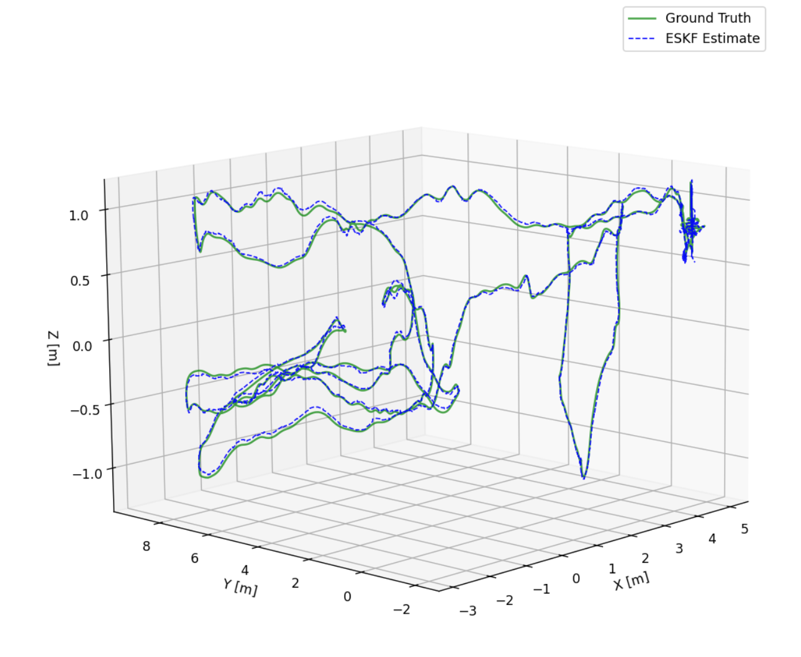
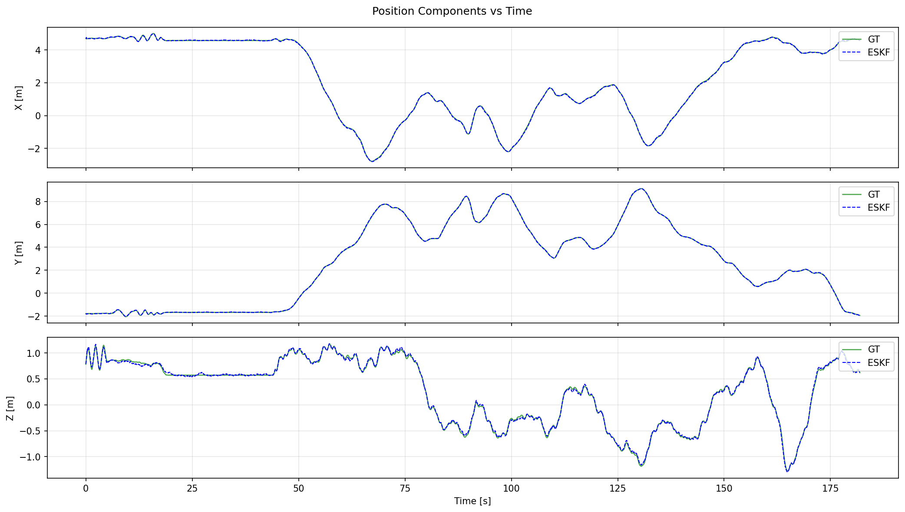
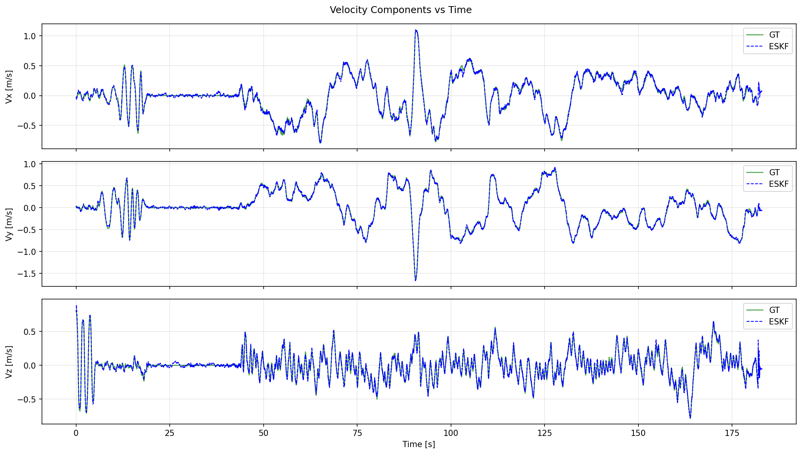
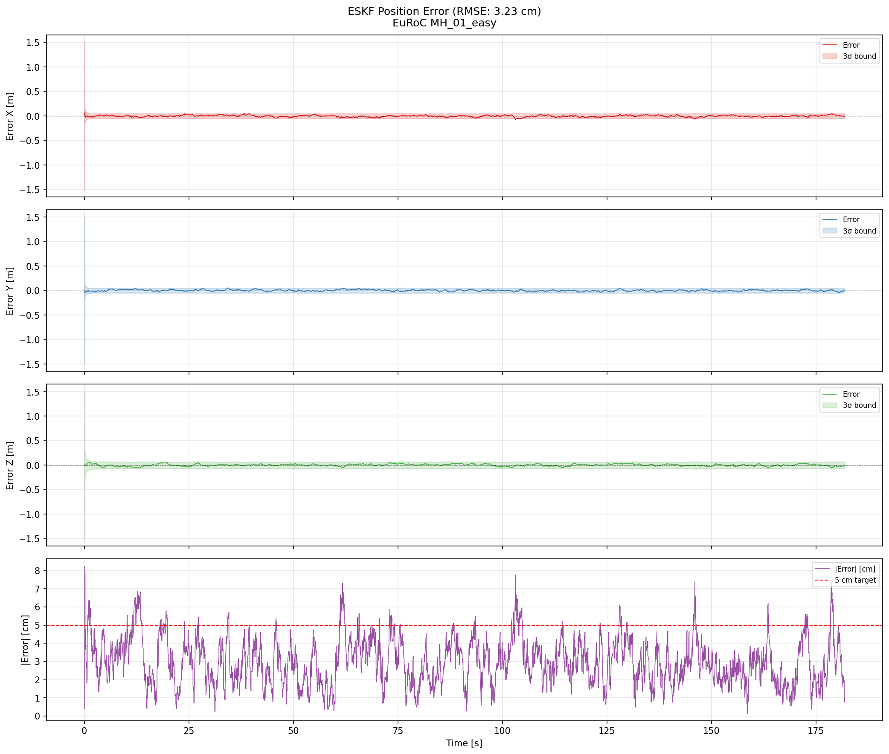

<div align="center">

# 🛰️ Sensor Fusion State Estimator

**15-State Error-State Kalman Filter in C++17**

Fuses IMU with simulated GPS and odometry corrections to estimate 6-DOF pose.
Built completely from scratch.

<br>

| Metric | Value |
|---|---|
| **3D Position RMSE** | **3.23 cm** |
| **Benchmark** | EuRoC MAV MH_01_easy |
| **IMU Rate** | 200 Hz |
| **GPS / Odom Rate** | 10 Hz each |
| **Flight Duration** | 180+ seconds |

</div>

---

## Results

<div align="center">



*ESKF estimate (blue dashed) tracks ground truth (green) through aggressive 3D maneuvers.*

</div>

<details>
<summary><b>Position & Velocity Tracking</b></summary>
<br>

<div align="center">



*Per-axis position: the filter stays locked to ground truth across all three axes.*

<br>



*Velocity estimation — accurate even during rapid direction changes.*

</div>

</details>

<details>
<summary><b>Error Analysis with 3σ Bounds</b></summary>
<br>

<div align="center">



*Position error stays well within the estimated 3σ covariance envelope. The filter is consistent — it knows what it doesn't know. Bottom panel: 3D error magnitude vs. the 5 cm target.*

</div>

</details>

<details>
<summary><b>Terminal Output</b></summary>
<br>

```
[INFO] Fusion complete.
  IMU samples processed:    36819
  GPS accepted/rejected:    1719 / 100
  Odom accepted/rejected:   1749 / 70

==========================================
    Position RMSE (over 36380 samples)
==========================================
  X:    1.823 cm
  Y:    1.618 cm
  Z:    2.117 cm
  3D:   3.228 cm
```

</details>

---

## How It Works

The filter maintains a **15-dimensional error state** in the tangent space of the nominal state, avoiding the singularities you'd get from a standard EKF on quaternions.

```
State = { position, velocity, quaternion, gyro_bias, accel_bias }
         ────────────────────────────────────────────────────────
         3D         3D        4D (S³)      3D          3D     = 16 elements

Error = [δp, δv, δθ, δb_g, δb_a] ∈ ℝ¹⁵   ← lives in the tangent space
```

**Prediction** — IMU at 200 Hz drives the state forward using **RK4 integration**. The quaternion is propagated on-manifold and renormalized every step.

**Update** — GPS and odometry corrections arrive at 10 Hz (simulated from ground truth with Gaussian noise — EuRoC has no real GPS or odometry). Each measurement passes a **Mahalanobis χ² gate** (95th percentile, 3-DOF) before being fused. Outliers are rejected automatically.

**Stability** — Covariance is updated using the **Joseph form** (`P = (I−KH)P(I−KH)ᵀ + KRKᵀ`), which guarantees symmetry and positive-definiteness even under numerical noise.

```
┌─────────────┐     ┌──────────────┐     ┌────────────────────┐
│  IMU 200 Hz │────▸│              │────▸│  6-DOF Pose        │
├─────────────┤     │  ESKF Core   │     │  + IMU Biases      │
│  GPS* 10 Hz │────▸│  (15-state)  │     │  + Covariance (P)  │
├─────────────┤     │              │     │                    │
│ Odom* 10 Hz │────▸│              │     │  → trajectory.csv  │
└─────────────┘     └──────────────┘     └────────────────────┘
```
*\* GPS and odometry are simulated from ground truth — EuRoC provides neither.*

---

## Project Structure

```
include/
  eskf/       ESKF core — State, ImuPredictor, GpsUpdater, OdomUpdater
  io/         CSV loader / result writer
  utils/      Quaternion math, Mahalanobis gating, noise simulator
src/          C++ implementations (mirrors include/)
tests/        Google Test suite — 51 passing tests
scripts/      Python visualization & dataset extraction
docs/         Algorithm derivation, usage guide
```

---

## Quick Start

**Prerequisites:** [MSYS2](https://www.msys2.org) with UCRT64 toolchain

```bash
# Install dependencies (MSYS2 UCRT64 shell)
pacman -S mingw-w64-ucrt-x86_64-{gcc,cmake,ninja,eigen3,gtest,lld}

# Build
cmake --preset ucrt64-debug && cmake --build build/debug

# Run tests
ctest --preset test-debug --verbose

# Run the filter (download EuRoC MH_01_easy first)
./build/debug/sensor_fusion.exe \
  --imu data/MH_01_easy/imu0/data.csv \
  --gt  data/MH_01_easy/state_groundtruth_estimate0/data.csv \
  --out output/trajectory.csv

# Visualize
pip install numpy matplotlib scipy pandas
python scripts/visualize_trajectory.py
python scripts/plot_errors.py
```

Dataset: [EuRoC MAV MH_01_easy](https://www.research-collection.ethz.ch/entities/researchdata/bcaf173e-5dac-484b-bc37-faf97a594f1f) (~2.9 GB)

---

## Key Design Decisions

| Decision | Why |
|---|---|
| Error-state (not standard EKF) | Error stays small → better linearization, no singularities |
| Quaternion (not Euler) | No gimbal lock; multiplicative updates stay on S³ manifold |
| RK4 (not Euler integration) | Captures curvature at high angular velocities |
| Joseph form covariance | Guaranteed PSD even under float rounding |
| Mahalanobis gating | Rejects GPS/odom outliers before they corrupt the state |
| Noise inflation (10-20×) | Keeps Kalman gain responsive to sensor corrections |

---

## References

- Solà, J. (2017). *Quaternion kinematics for the error-state Kalman filter.* [arXiv:1711.02508](https://arxiv.org/abs/1711.02508)
- Burri, M. et al. (2016). *The EuRoC micro aerial vehicle datasets.* IJRR.
